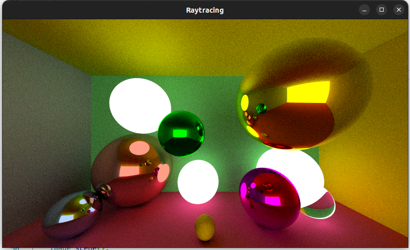

# Raytracer
The program is free-to-use for all kinds of developers.

***
## What does the project do
This is an implementation of raytracing technique written on C++ language. [SFML library](https://www.sfml-dev.org/) was used for
displaying the result on the screen. In this implementation Phong reflection model is used. Being relatively simple in comparison with
other models, it gives shockingly beautiful picture!

***
## Why is the project useful
Raytracing is one of the most powerful ways of creating pseudo 3D object on 2D plane. Demanding much processing power, a great deal of time
or even both, it produces really photorealistic pictures. This technology is widely used in modeling and gaming to receive amazing graphics,
so the relevance of this technology is undeniable. 

***
## How to launch
```c++
   $ git clone https://github.com/kirilliliych/Raytracer.git
   $ make
```

***
## Screenshots


***
## How can I help
I explicitly welcome any outside contributors. Use my mail: _ilichev.kv@phystech.edu_.

__A strong request__:
- Do not break the codestyle
- Do not destroy previous functionality with additions

***
## Where to ask questions
Use the mail mentioned earlier.
